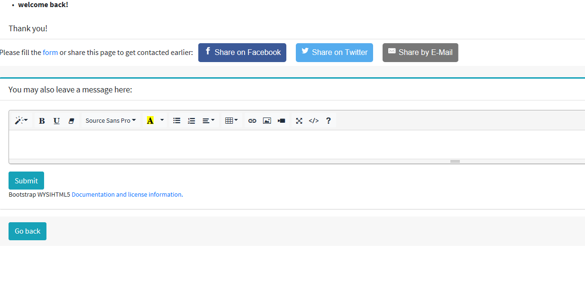

# user_collecting
  
This is a flask web module of collecting users. The funcitons are that:  
the users are collected through email addresses they input;  
the email addresses are input into a waiting list database with a time sequence;  
an email address will be ranked to the top when the corresponding user shares a specified webpage on social media (like Facebook);  
an email address will be ranked to the top when the corresponding user filled a specified questionnaire on Typeform;  
and a user will be able to leave a complicated message into the database after inputting or reinputting the corresponding email address.  
Note that the waiting list can be see through the route "/waiting_list".

# related art
Flask, sqlalchemy, Typeform Webhooks, AdminLTE, sharingbuttons.io
